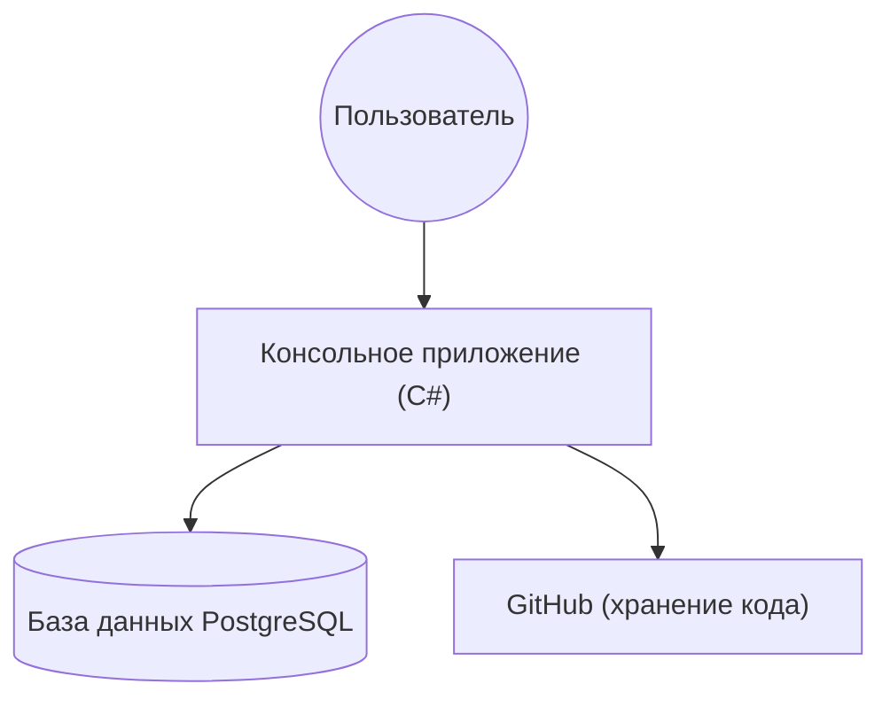
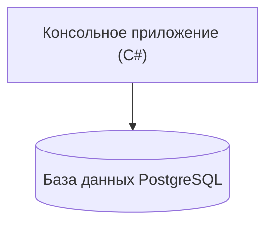
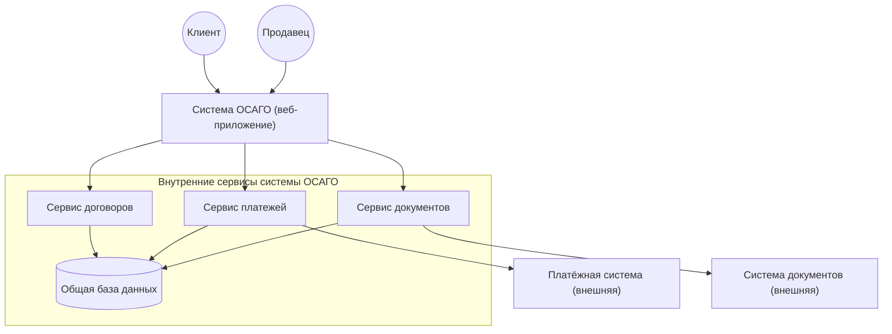
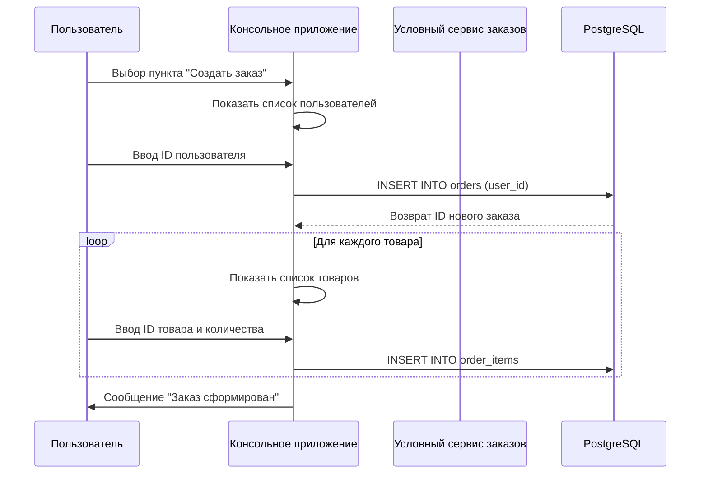
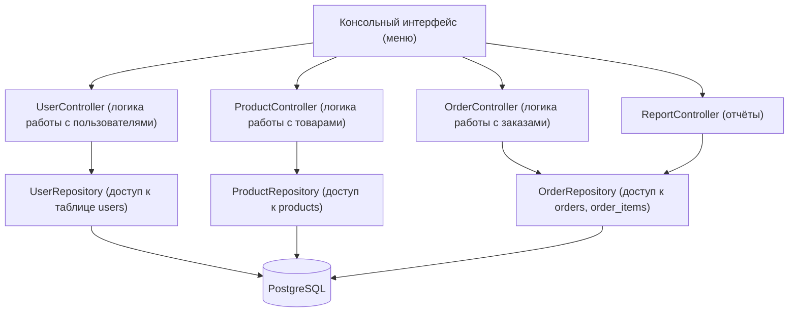

# Производственная практика — PP_Anna

**Студент:** Анна
**Куратор:** Сергей
**Дата начала:** 01.06.2026 
**Дата окончания:** 03.07.2026 
## Задания по неделям

- [Задания первой недели](задания/week_1_tasks.md)
- [Задания второй недели](задания/week_2_tasks.md)
- [Задания третьей недели](задания/week_3_tasks.md)
## Ежедневный отчёт по производственной практике.

### 01.06.2026 (пн)
- **Сделано:**  
  - Ознакомилась с программой практики.  
  - Установлен Visual Studio Code и настрон для дальнейшей работы.  
  - Состаялся созвон с командой по распределение задачь на рабочую неделю.
  - Пройден вводный инструктаж по технике безопасности на рабочем месте, оформлен в журнале. Основные правила: соблюдение электробезопасности, правильная посадка за компьютером, режим труда и отдыха.

### 02.06.2026 (вт)
- **Сделано:**  
  - Создан аккаунт для ПП на GitHub.  
  - Установлен Git, настроен в VS Code (расширения C# Dev Kit).  
  - Создан репозиторий PP_Anna, настроин .gitignore.  
  - Состоялась Kafka(на тему устранения неполадок).  
- **Решёные трудности:**  
  - Вложенным Git-репозиторием.

### 03.06.2026 (ср)

- **Сделано:**
  - Установлена и настроена PostgreSQL 18.4.
**Сложность:** После установки PostgreSQL сервер не запускался автоматически, pgAdmin выдавал ошибку подключения.
**Решение предпринятые:**
1. Нажат `Win + R`, введён `services.msc`, нажат Enter.
2. В списке служб найден не с первой попытки после перезагрузок `postgresql-x64-18`.
3. Нажат правой кнопкой и после «Запустить».
4. После этого ераз перезагружается компьютер.
5. Сервер заработал, подключение в pgAdmin успешно.
  - Изучение Федерального закона "О персональных данных" № 152-ФЗ. Составлен краткий конспект и чеклист для разработчика, и оформилен в файл `security.md`. **И этот файл -** `security.md` в репозитории по 152-ФЗ. **Артефакт:** Подробный разбор 152-ФЗ и чек-лист разработчика - [security.md](security.md)

- **Итог:** PostgreSQL запущен и готов к работе.
  - Создана база данных `Золотце`.
  - Создана таблица `users` с полями: id, name, age, city.
  - Добавлены тестовые данные (3 пользователей).
  - Выполнены SQL-запросы: `SELECT * FROM users;` для проверки введённых данных.
### 04.06.2026 (чт)

- **Сделано:**
  - Создана база данных «Золотце» с таблицами `users`, `products`, `orders`, `order_items`.
  - Установлены связи между таблицами.
  - Заполнено 10 пользователей, 10 товаров, 10 заказов и позиции заказов.
  - Написаны SQL-запросы для выборки данных (JOIN, агрегация).
- **Артефакты:**
  - [database_setup.sql](database_setup.sql) — полный скрипт создания и наполнения БД.
- **Трудности решены путём:** Настройки внешних ключей и правильности, корректности связанных данных.

- **Сделано:**
  - Разработано консольное приложение на C# для управления базой данных «Золотце».
  - Реализованы все операции CRUD для пользователей, товаров, заказов.
  - Добавлены функции: создание заказа с выбором товаров, добавление позиций, смена статуса заказа, удаление заказа (каскадно).
  - Сделаны отчёты: топ‑5 дорогих товаров, сумма покупок по клиентам, количество заказов по статусам.
  - Код оптимизирован, вынесены вспомогательные методы, добавлены подробные комментарии.
- **Проверка:** Приложение успешно запускается, подключается к БД «Золотце», все меню работают.

### 05.06.2026 (пт)
- **Сделано:**
  - Составленно 3 С4-диаграммы - контекста, контейнера и компонента.
  - Скорректирована отчётность за первую неделю производственной практики.
  - Проверена, оценена куратором вся проделанная работа.
  - Подведены итоги недели.

## С4-диаграмма контекста cистемы

## С4-диаграмма контейнеров

## C4-диаграмма компонентов 

### 08.06.2026 (пн)

- **Что сделано:**
  - Составлена таблица сравнения методологий Waterfall, Agile, Scrum, Kanban.
  - Написаны 3 User Stories с критериями приёмки для системы «Золотце».
  - Выделены сущности, value object, агрегаты в нотации DDD.
- **Артефакт:** [requirements.md](requirements.md)

### 09.06.2026 (вт)

- **Что сделано:**
  - Создана диаграмма последовательности для сценария «Создание заказа».
  - Создана диаграмма компонентов, отражающая архитектуру приложения «Золотце».
- **Артефакты:** диаграммы в формате Mermaid (см. ниже).

#### Диаграмма последовательности (Sequence Diagram)
- Сценарий: пользователь создаёт новый заказ, добавляет товары, система сохраняет заказ и его позиции.

### Диаграмма компонентов (Component Diagram)
- Показывает внутреннее устройство консольного приложения «Золотце» на уровне компонентов.

### чахрянятси
### 10.06.2026 (ср)

- **Что сделано:**
  - Установлен и настроен инструмент `dotnet-ef`.
  - Создан проект `EfCoreDemo` с сущностями и контекстом данных.
  - Выполнена миграция `InitialCreate` для создания структуры БД.
- **Артефакты:** [папка EfCoreDemo](EfCoreDemo/)
- **Реализовано с помощью:**
  - Команда `dotnet ef migrations add InitialCreate` выполнена успешно.
  - База данных обновлена с помощью `dotnet ef database update`.

### 11.06.2026 (чт) 

- **Что сделано:**
  - Исправление конфликта миграций EF Core.
  - При применении миграции `ApplyPendingChanges` возник конфликт: таблица `OrderStatuses` уже существовала в БД.
  - Причина: ручное создание таблицы через SQL.
  - Решение: удалила таблицу `OrderStatuses` и повторно применила миграцию. EF Core создал таблицу и заполнил её через `HasData`.
  - Теперь база данных синхронизирована с моделью EF Core.
- **Что сделано:**
  - Написан набор юнит-тестов для `UserRepository` с использованием InMemory-базы данных.
  - Протестированы методы: GetAll, GetById, Add, Update, Delete, обработка null.
  - Все тесты успешно проходят.
- **Артефакты:** [код тестов](EfCoreDemo.Tests/UnitTests/UserRepositoryTests.cs)
- **Интеграционные тесты:** подготовлена заготовка с Testcontainers (номинально).

### 12.06.2026 (пт)

- **Что сделано:**
  - Проведён анализ выполненных заданий за дни 6–10.
  - Скорректирована отчётность, приведены в порядок файлы репозитория.
  - Удалены дублирующиеся и временные файлы, структура приведена к чистоте.
- **Итоги недели:**
  - Освоены методологии, User Stories, DDD.
  - Созданы диаграммы последовательности и компонентов.
  - Реализованы миграции EF Core и асинхронные запросы.
  - Написаны юнит-тесты (8 шт.), подготовлены интеграционные тесты.
  - Репозиторий полностью готов к рефакторингу и ревью.

### 15.06.2026 (пн)

- **Что сделано:**
  - Начат рефакторинг основного `Program.cs` – выделение логики в отдельные классы.
  - Создан класс `UserService`, перенесены методы работы с пользователями.
  - Исправлены предупреждения анализатора кода (CS8618) путём добавления конструкторов или инициализации.
  - Проведён статический анализ с `dotnet format` (предупреждения уровня Warning исправлены).
  - Проведён полный рефакторинг основного приложения: логика работы с пользователями вынесена в отдельный класс `UserService`.
  - Устранены предупреждения анализатора кода (CS8618) путём добавления конструкторов и инициализации свойств.
  - Выполнен статический анализ с помощью `dotnet format`; все предупреждения уровня Warning исправлены.
  - Проведена финальная отладка: приложение успешно запускается, все функции (просмотр/добавление/изменение/удаление пользователей, работа с товарами, заказами, отчёты) проверены.
- **Трудности:**
  - При сборке в основной папке репозитория возник конфликт из-за наличия вспомогательных проектов (`EfCoreDemo` и `EfCoreDemo.Tests`). Для демонстрации работоспособности приложение собрано и запущено в отдельной чистой папке (`ghjop`). Исходный код полностью идентичен и выложен в репозиторий.
- **Результат:** Рефакторинг завершён, код соответствует принципам SOLID, приложение стабильно работает.

### 16.06.2026 (вт)

**День 11: Producer** **что зделано: **
- Создан Web API проект `PP_Anna.Api`.
- Реализован контроллер `KafkaController` с эндпоинтом `POST /api/Kafka/send`.
- Добавлен мок-продюсер `KafkaProducerMock` для имитации отправки сообщений.
- Подключен Swagger для тестирования.
**День 12: Consumer** **что зделано: **
- Реализован фоновый сервис `KafkaConsumerMock`, имитирующий чтение сообщений.
- Реализована логика повторных попыток (3 попытки) с экспоненциальной задержкой (1с, 2с, 4с).
- При исчерпании попыток сообщение отправляется в DLQ (имитация).
- В логах видно: успешные обработки, ретраи и отправка в DLQ для сообщений с ошибками.
**Артефакты:**
- Исходный код Producer и Consumer в папке `PP_Anna.Api`.
- Документация по паттернам в [kafka-patterns.md](kafka-patterns.md).
- Логи работы приложения приложены в отчёте (скриншоты / выдержки).
**Проверка:**
- Приложение запускается, Swagger доступен.
- Отправка сообщений через Swagger работает (появляются логи).
- ConsumerMock генерирует события, ретраи и DLQ отрабатывают корректно.

