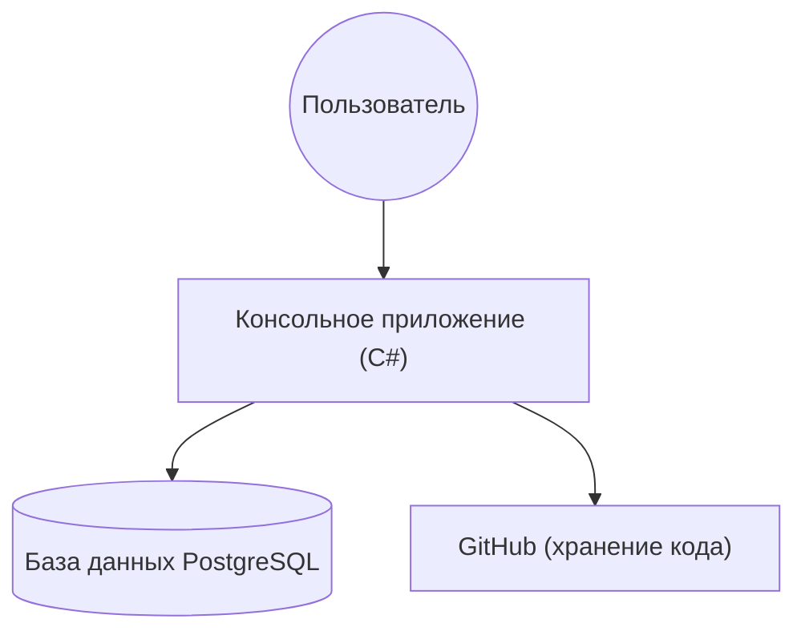
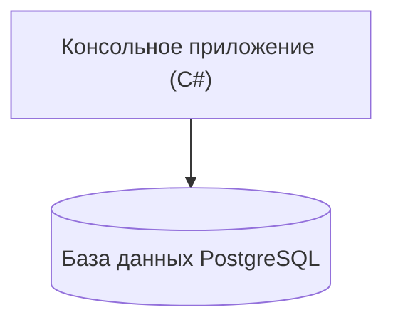
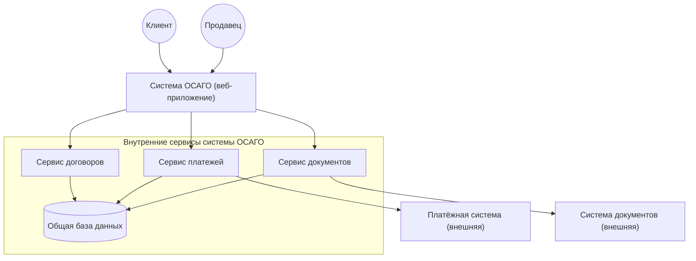
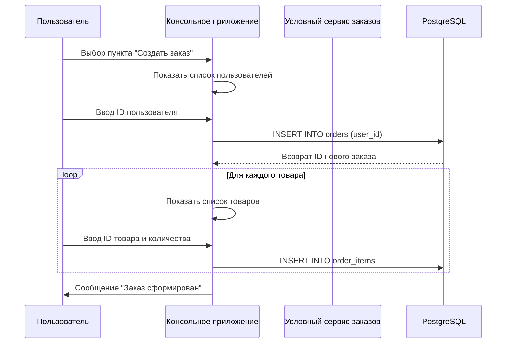
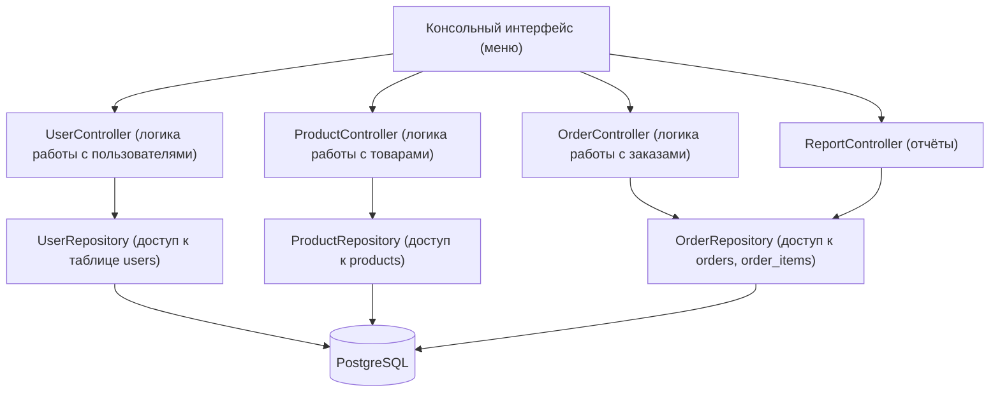

# Производственная практика — PP_Anna

**Студент:** Анна
**Куратор:** Сергей
**Дата начала:** 01.06.2026 
**Дата окончания:** 03.07.2026 
## Задания по неделям

- [Задания 1 недели](задания/week_1_tasks.md)
- [Задания 2 недели](задания/week_2_tasks.md)
- [Задания 3 недели](задания/week_3_tasks.md)
- [Задания 4 недели](задания/week_4_tasks.md)
- [Задания 5 недели](задания/week_5_tasks.md)

## Установка и запуск проекта

### Требования
- .NET 10 SDK (скачать с https://dotnet.microsoft.com)
- PostgreSQL 18.4 или выше (скачать с https://www.postgresql.org)
- Docker Desktop (опционально, для запуска Redis, Kafka, Vault)

### 1. Клонирование репозитория
```bash
git clone https://github.com/jiji787/PP_Anna.git
cd PP_Anna
```

### 2. Настройка базы данных
- Убедитесь, что PostgreSQL запущен (служба `postgresql-x64-18` должна быть активна).
- Создайте базу данных из скрипта. Можно выполнить в pgAdmin или через командную строку:
```bash
psql -U postgres -f database_setup.sql
```
- Если используете pgAdmin, откройте файл `database_setup.sql` и выполните его содержимое в Query Tool.

### 3. Запуск консольного приложения (CRUD)
В корне репозитория выполните:
```bash
dotnet run
```
Приложение предложит меню для работы с пользователями, товарами, заказами и отчётами.

### 4. Запуск Web API (с интеграцией Kafka, Redis, Vault)
Перейдите в папку `PP_Anna.Api` и выполните:
```bash
cd PP_Anna.Api
dotnet run
```
Swagger будет доступен по адресу: `http://localhost:5082/swagger`

### 5. Запуск вспомогательных сервисов через Docker (опционально)
Если хотите проверить работу с Redis, Vault и Kafka, запустите контейнеры:
```bash
# Redis
docker run -d --name redis-stack -p 6379:6379 redis/redis-stack:latest

# Vault
docker run -d --name vault-dev -p 8200:8200 -e VAULT_DEV_ROOT_TOKEN_ID=root hashicorp/vault:latest

# Kafka + Zookeeper
docker run -d --name zookeeper -p 2181:2181 wurstmeister/zookeeper
docker run -d --name kafka -p 9092:9092 -e KAFKA_LISTENERS=PLAINTEXT://:9092 -e KAFKA_ADVERTISED_LISTENERS=PLAINTEXT://localhost:9092 -e KAFKA_ZOOKEEPER_CONNECT=zookeeper:2181 --link zookeeper wurstmeister/kafka
```

### 6. Запуск тестов
```bash
dotnet test
```

==================================================
## Ежедневный отчёт по производственной практике.
### 01.06.2026 (пн)
- **Сделано:**  
  - Ознакомилась с программой практики.  
  - Установлен Visual Studio Code и настрон для дальнейшей работы.  
  - Состаялся созвон с командой по распределение задачь на рабочую неделю.
  - Пройден вводный инструктаж по технике безопасности на рабочем месте, оформлен в журнале. Основные правила: соблюдение электробезопасности, правильная посадка за компьютером, режим труда и отдыха.

### 02.06.2026 (вт)
- **Сделано:**  
  - Создан аккаунт для ПП на GitHub.  
  - Установлен Git, настроен в VS Code (расширения C# Dev Kit).  
  - Создан репозиторий PP_Anna, настроин .gitignore.  
  - Состоялась Kafka(на тему устранения неполадок).  
- **Решёные трудности:**  
  - Вложенным Git-репозиторием.

### 03.06.2026 (ср)

- **Сделано:**
  - Установлена и настроена PostgreSQL 18.4.
**Сложность:** После установки PostgreSQL сервер не запускался автоматически, pgAdmin выдавал ошибку подключения.
**Решение предпринятые:**
1. Нажат `Win + R`, введён `services.msc`, нажат Enter.
2. В списке служб найден не с первой попытки после перезагрузок `postgresql-x64-18`.
3. Нажат правой кнопкой и после «Запустить».
4. После этого ераз перезагружается компьютер.
5. Сервер заработал, подключение в pgAdmin успешно.
  - Изучение Федерального закона "О персональных данных" № 152-ФЗ. Составлен краткий конспект и чеклист для разработчика, и оформилен в файл `security.md`. **И этот файл -** `security.md` в репозитории по 152-ФЗ. **Артефакт:** Подробный разбор 152-ФЗ и чек-лист разработчика - [security.md](security.md)

- **Итог:** PostgreSQL запущен и готов к работе.
  - Создана база данных `Золотце`.
  - Создана таблица `users` с полями: id, name, age, city.
  - Добавлены тестовые данные (3 пользователей).
  - Выполнены SQL-запросы: `SELECT * FROM users;` для проверки введённых данных.
### 04.06.2026 (чт)

- **Сделано:**
  - Создана база данных «Золотце» с таблицами `users`, `products`, `orders`, `order_items`.
  - Установлены связи между таблицами.
  - Заполнено 10 пользователей, 10 товаров, 10 заказов и позиции заказов.
  - Написаны SQL-запросы для выборки данных (JOIN, агрегация).
- **Артефакты:**
  - [database_setup.sql](database_setup.sql) — полный скрипт создания и наполнения БД.
- **Трудности решены путём:** Настройки внешних ключей и правильности, корректности связанных данных.

- **Сделано:**
  - Разработано консольное приложение на C# для управления базой данных «Золотце».
  - Реализованы все операции CRUD для пользователей, товаров, заказов.
  - Добавлены функции: создание заказа с выбором товаров, добавление позиций, смена статуса заказа, удаление заказа (каскадно).
  - Сделаны отчёты: топ‑5 дорогих товаров, сумма покупок по клиентам, количество заказов по статусам.
  - Код оптимизирован, вынесены вспомогательные методы, добавлены подробные комментарии.
- **Проверка:** Приложение успешно запускается, подключается к БД «Золотце», все меню работают.

### 05.06.2026 (пт)
- **Сделано:**
  - Составленно 3 С4-диаграммы - контекста, контейнера и компонента.
  - Скорректирована отчётность за первую неделю производственной практики.
  - Проверена, оценена куратором вся проделанная работа.
  - Подведены итоги недели.

## С4-диаграмма контекста cистемы

## С4-диаграмма контейнеров

## C4-диаграмма компонентов 


### 08.06.2026 (пн)

- **Что сделано:**
  - Составлена таблица сравнения методологий Waterfall, Agile, Scrum, Kanban.
  - Написаны 3 User Stories с критериями приёмки для системы «Золотце».
  - Выделены сущности, value object, агрегаты в нотации DDD.
- **Артефакт:** [requirements.md](requirements.md)

### 09.06.2026 (вт)

- **Что сделано:**
  - Создана диаграмма последовательности для сценария «Создание заказа».
  - Создана диаграмма компонентов, отражающая архитектуру приложения «Золотце».
- **Артефакты:** диаграммы в формате Mermaid (см. ниже).

#### Диаграмма последовательности (Sequence Diagram)
- Сценарий: пользователь создаёт новый заказ, добавляет товары, система сохраняет заказ и его позиции.

### Диаграмма компонентов (Component Diagram)
- Показывает внутреннее устройство консольного приложения «Золотце» на уровне компонентов.


### чахрянятси
### 10.06.2026 (ср)

- **Что сделано:**
  - Установлен и настроен инструмент `dotnet-ef`.
  - Создан проект `EfCoreDemo` с сущностями и контекстом данных.
  - Выполнена миграция `InitialCreate` для создания структуры БД.
- **Артефакты:** [папка EfCoreDemo](EfCoreDemo/)
- **Реализовано с помощью:**
  - Команда `dotnet ef migrations add InitialCreate` выполнена успешно.
  - База данных обновлена с помощью `dotnet ef database update`.

### 11.06.2026 (чт) 

- **Что сделано:**
  - Исправление конфликта миграций EF Core.
  - При применении миграции `ApplyPendingChanges` возник конфликт: таблица `OrderStatuses` уже существовала в БД.
  - Причина: ручное создание таблицы через SQL.
  - Решение: удалила таблицу `OrderStatuses` и повторно применила миграцию. EF Core создал таблицу и заполнил её через `HasData`.
  - Теперь база данных синхронизирована с моделью EF Core.
- **Что сделано:**
  - Написан набор юнит-тестов для `UserRepository` с использованием InMemory-базы данных.
  - Протестированы методы: GetAll, GetById, Add, Update, Delete, обработка null.
  - Все тесты успешно проходят.
- **Артефакты:** [код тестов](EfCoreDemo.Tests/UnitTests/UserRepositoryTests.cs)
- **Интеграционные тесты:** подготовлена заготовка с Testcontainers (номинально).

### 12.06.2026 (пт)

- **Что сделано:**
  - Проведён анализ выполненных заданий за дни 6–10.
  - Скорректирована отчётность, приведены в порядок файлы репозитория.
  - Удалены дублирующиеся и временные файлы, структура приведена к чистоте.
- **Итоги недели:**
  - Освоены методологии, User Stories, DDD.
  - Созданы диаграммы последовательности и компонентов.
  - Реализованы миграции EF Core и асинхронные запросы.
  - Написаны юнит-тесты (8 шт.), подготовлены интеграционные тесты.
  - Репозиторий полностью готов к рефакторингу и ревью.

### 15.06.2026 (пн)

- **Что сделано:**
  - Начат рефакторинг основного `Program.cs` – выделение логики в отдельные классы.
  - Создан класс `UserService`, перенесены методы работы с пользователями.
  - Исправлены предупреждения анализатора кода (CS8618) путём добавления конструкторов или инициализации.
  - Проведён статический анализ с `dotnet format` (предупреждения уровня Warning исправлены).
  - Проведён полный рефакторинг основного приложения: логика работы с пользователями вынесена в отдельный класс `UserService`.
  - Устранены предупреждения анализатора кода (CS8618) путём добавления конструкторов и инициализации свойств.
  - Выполнен статический анализ с помощью `dotnet format`; все предупреждения уровня Warning исправлены.
  - Проведена финальная отладка: приложение успешно запускается, все функции (просмотр/добавление/изменение/удаление пользователей, работа с товарами, заказами, отчёты) проверены.
- **Трудности:**
  - При сборке в основной папке репозитория возник конфликт из-за наличия вспомогательных проектов (`EfCoreDemo` и `EfCoreDemo.Tests`). Для демонстрации работоспособности приложение собрано и запущено в отдельной чистой папке (`ghjop`). Исходный код полностью идентичен и выложен в репозиторий.
- **Результат:** Рефакторинг завершён, код соответствует принципам SOLID, приложение стабильно работает.

### 16.06.2026 (вт)

**День 11: Producer (что зделано:)**
- Создан Web API проект `PP_Anna.Api`.
- Реализован контроллер `KafkaController` с эндпоинтом `POST /api/Kafka/send`.
- Добавлен мок-продюсер `KafkaProducerMock` для имитации отправки сообщений.
- Подключен Swagger для тестирования.

**День 12: Consumer (что зделано:)**
- Реализован фоновый сервис `KafkaConsumerMock`, имитирующий чтение сообщений.
- Реализована логика повторных попыток (3 попытки) с экспоненциальной задержкой (1с, 2с, 4с).
- При исчерпании попыток сообщение отправляется в DLQ (имитация).
- В логах видно: успешные обработки, ретраи и отправка в DLQ для сообщений с ошибками.

**Артефакты:**
- Исходный код Producer и Consumer в папке `PP_Anna.Api`.
- Логи работы приложения приложены в отчёте (скриншоты / выдержки).

**Проверка:**
- Приложение запускается, Swagger доступен.
- Отправка сообщений через Swagger работает (появляются логи).
- ConsumerMock генерирует события, ретраи и DLQ отрабатывают корректно.

### 17.06.2026 (ср)

**Что сделано:**
- Проведена чистка репозитория: удалены дублирующиеся папки проектов (`__EfCoreDemo`, `__EfCoreDemo.Tests`), оставлены рабочие версии.
- Удалены папки сборки `bin` и `obj` из индекса Git и из файловой системы.
- Создан и настроен файл `.gitignore` для исключения временных и служебных файлов.
- Выполнена сборка проекта `PP_Anna.Api` – успешно, ошибок нет.
- Обновлена структура решения: добавлены основные проекты в файл `.sln`.

**Трудности:**
- При добавлении проектов в решение возникли ошибки из-за неправильных путей (дублирующиеся папки). Решено переименованием и удалением дубликатов.
- Папки `bin/obj` снова попали в коммит из-за отсутствия `.gitignore` – после добавления правил проблема устранена.

**Результат:** Репозиторий приведён к чистой структуре, все проекты собираются, `.gitignore` настроен.
 
### 18.06.2026 (чт)

**Сделано:**
- Изучена документация и обучающие видео по Docker, Redis и Vault – их назначение, устройство, сценарии использования, история создания.
- Проверен и проанализирован код, написанный за предыдущие дни; выявлены потенциальные проблемы и ошибки в реализации кэширования и работы с секретами.
- Сформировано понимание, как должно работать кэширование и управление секретами в проекте.

**Трудности:**
- Отсутствие практического опыта с Docker и Redis; много времени ушло на теорию.

**Результат:** теоретическая база готова, выявлены ошибки, которые предстоит исправить.

---

### 19.06.2026 (пт)

**Сделано:**
- Установлен Docker Desktop, настроена WSL, включена виртуализация в BIOS (через настройки UEFI).
- Запущен контейнер Redis через Docker (команда `docker run -d --name redis-stack -p 6379:6379 redis/redis-stack:latest`).
- В проект `PP_Anna.Api` добавлены файлы:
  - `Services/ICacheService.cs` – интерфейс кэширования.
  - `Services/MockCacheService.cs` – мок-реализация кэша (работает без Redis).
  - `Services/RedisCacheService.cs` – реальная реализация с подключением к Redis.
  - `Services/ISecretService.cs` – интерфейс для работы с секретами.
  - `Services/MockSecretService.cs` – мок-реализация для Vault.
  - `Controllers/CacheController.cs` – контроллер для тестирования кэширования.
  - `Controllers/SecretController.cs` – контроллер для тестирования секретов.
- Исправлены ошибки компиляции:
  - неоднозначный вызов `JsonSerializer.Deserialize` (заменён на `value.ToString()`);
  - проблема с передачей `TimeSpan` в `StringSetAsync` (заменено на раздельный вызов `StringSetAsync` и `KeyExpireAsync`);
  - несоответствие возвращаемых типов в `ISecretService` и `MockSecretService` (исправлено на `Task<string?>`).
- Выполнена успешная сборка проекта `dotnet build` и запуск `dotnet run`.
- Проверена работа через Swagger (доступен по `http://localhost:5082/swagger`): контроллеры `CacheController` и `SecretController` работают, кэширование функционирует (при отсутствии Redis – через мок, с реальным Redis – через него).

**Трудности:**
- Долгая настройка виртуализации и WSL (пришлось перезагружаться, искать настройки в BIOS).
- Множество ошибок компиляции (сначала 97, затем последовательное исправление до одной).
- Отсутствие опыта работы с Docker и Redis, но все команды были освоены в процессе.

**Результат:** проект полностью собран, Docker и Redis запущены, кэширование и работа с секретами реализованы, всё проверено через Swagger. Дни 13 и 14 завершены.
 
 ### 22.06.2026 (пн) – День 14 и День 15

**День 14: Vault (работа с секретами)**

**Сделано:**
- Запущен контейнер Vault в режиме разработки через Docker (образ hashicorp/vault, порт 8200, токен root).
- Реализован сервис VaultSecretService для чтения секретов из Vault с использованием библиотеки VaultSharp.
- Добавлена автоматическая подмена: если Vault доступен – используется реальный сервис, иначе – MockSecretService.
- В Vault записаны тестовые секреты: DbPassword, ApiKey, JwtSecret.
- Проверена работа через Swagger: запрос секрета возвращает значение из Vault.

Трудности:
- Изначально использовался неправильный образ vault:latest (не существует). Заменён на hashicorp/vault:latest.
- Команды curl в PowerShell не работали из-за синтаксиса; использованы Invoke-RestMethod с правильными заголовками.

**День 15: Документация (Swagger + openapi.json)**

**Сделано:**
- Включена генерация XML-документации в проекте (GenerateDocumentationFile).
- Добавлены XML-комментарии (summary, param, returns) ко всем методам контроллеров.
- Swagger настроен на отображение комментариев (IncludeXmlComments).
- Экспортирована OpenAPI-спецификация в файл swagger.json (сохранён в корне репозитория).
- Документация API теперь полностью описана и доступна через Swagger UI.

Трудности:
- XML-комментарии были размещены после атрибутов, что вызывало предупреждения CS1587. Исправлено переносом комментариев перед атрибутами.
- В файле проекта была синтаксическая ошибка (незакрытый тег). Исправлена ручной правкой .csproj.

Результат:
- Приложение успешно собирается и запускается.
- Redis и Vault подключены, работают.
- Swagger отображает описания методов, openapi.json экспортирован.
- Дни 14 и 15 полностью завершены.

### 23.06.2026 (вт)

**что сделано:**
- Включено логирование медленных запросов (log_min_duration_statement = 1000).
- Создана тестовая таблица big_table с 50 000 записей.
- Выполнен медленный запрос с LIKE '%abc%' без индекса – время выполнения > 1 секунды.
- Проанализирован план запроса через EXPLAIN ANALYZE – обнаружено последовательное сканирование (Seq Scan).
- Симулирована блокировка: две транзакции, одна обновляет строку и не завершается, вторая ждёт.
- Блокировка обнаружена через запрос к pg_locks.

**Артефакты:**
- Лог медленных запросов и блокировок: [logs/postgresql_log_2026-06-23.txt](logs/postgresql_log_2026-06-23.txt)

### 24.06.2026 (ср)

**Что сделано:**
- Полностью переработан Consumer: теперь он пересоздаётся при любой критической ошибке, устойчив к отсутствию топика, добавлена задержка перед подключением.
- Проверена интеграция: через Swagger отправлено сообщение, Consumer успешно получил и обработал его с коммитом смещения.
- Устранены все предупреждения компиляции.
- Добавлены артефакты администрирования в папку `deploy/` (роли, бэкап, docker-compose.prod.yml).
- Создан документ `security-db.md` с политикой безопасности БД и описанием мониторинга.

**Артефакты:**
- Исходный код Producer/Consumer в `PP_Anna.Api/Services/`.
- Документы безопасности и мониторинга – [security-db.md](security-db.md).
- Скрипты администрирования – [deploy/](deploy/).

### 25.06.2026 (чт)

**Что сделано:**
- Проведена финальная проверка репозитория: все файлы на месте, ссылки рабочие.
- Добавлен раздел «Соответствие заданиям практики» с привязкой каждого пункта к артефактам.
- Исправлены мелкие опечатки в README и комментариях к коду.
- Подготовлены пояснения для куратора по каждому этапу работы.

### 26.06.2026 (пт)

**Что сделано:**
- Проверена работа консольного приложения (CRUD, отчёты) – все функции стабильны.
- Проверена работа Web API через Swagger: эндпоинты Kafka, Cache, Secret – отвечают корректно.
- Выполнена финальная синхронизация с GitHub (все изменения закоммичены и запушины).
- Составлен краткий план ответов на возможные вопросы куратора.

### 29.06.2026 (вт)

**Что сделано:**
- Проведено профилирование запроса "Сумма покупок по клиентам" с использованием `Stopwatch`.
- Время выполнения составило от 11 до 118 мс (среднее ~71 мс) – запрос уже оптимизирован благодаря ранее добавленным индексам.
- Создан отчёт `profiling-report.md` с результатами замеров и выводами.
- Устранены конфликты сборки: временно перемещены вспомогательные проекты в папку `_old` для чистой сборки консольного приложения.

**Артефакты:** [profiling-report.md](profiling-report.md), обновлённый `Program.cs` (добавлен замер времени).

**Трудности:** при сборке мешали дублирующиеся проекты (`__EfCoreDemo`, `__EfCoreDemo.Tests`, `PP_Anna.Api`), но они были перемещены в `_old`, после чего сборка прошла успешно.

**Результат:** день 21 завершён, приложение работает стабильно.
